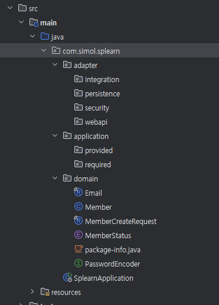

# Splearn 개발 가이드

## 아키텍처
- 헥사고날
- DDD

### 계층
- Domain Layer
- Application Layer
- Adapter Layer

## 패키지
- domain
- application
  - required
  - provided
- adpater
  - webapi
  - persistence
  - integration
  - security

