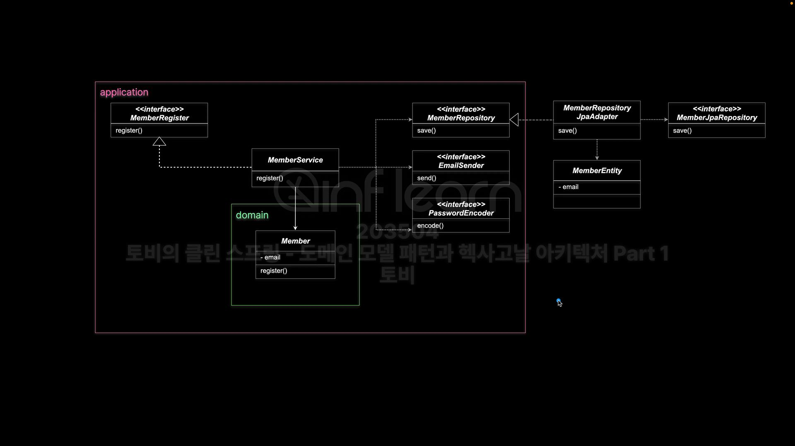

### 🟢 JPA 모델과 도메인 모델은 다른 것인가?
- 도메인 모델은 DB와 매핑되는 데이터 모델과 다르며 이를 분리해야 한다
  - 어댑터 계층에 JPA 엔티티 등의 모델을 따로 만들고
  - Repository를 구현한 어댑터를 이용해서 도메인 오브젝트와 JPA 오브젝트를 매핑해준다
  - Member 외에 MemberEntity 클래스를 만들어 JPA 관련 설정은 모두 이곳으로 옮긴다
  - MemberRepository를 구현한 MemberRepositoryJpaAdapter에서 이 두가지 오브젝트를 서로 매핑해주는 코드를 작성한다
    

### 🟢 굳이 이렇게 분리하여 적용하는 방법을 사용하는 이유
- 데이터 모델과 도메인 모델이 너무 다른 경우 
  - 레거시 프로젝트 DB에 도메인 모델 설계를 적용하는 경우
- 복잡한 도메인 모델이 데이터 모델과 간단히 매핑되지 않는 경우
  - 여러 join 으로 해결해야되거나 여러 계산 로직으로 값을 처리하는 경우
  - JPA 모델과는 다른 도메인 모델이 존재한다면
- 데이터 저장 기술이 바뀌는 경우
  - 흔한 경우는 아님
  - Spring Data로 프로젝트를 구성한다면 이유가 되기 힘듦
- 코드에 등장하는 JPA 어노테이션은 기술 의존적이기 때문
  - 순수한 도메인 로직만 존재하는게 아닌 JPA 기술, 관심사가 다른 JPA 어노테이션/DB정보가 추가되기 때문

### 🟢 JPA 기술의 정체성
- ORM : 패러다임이 다른 관계형 DB와 객체지향 모델의 불일치를 해결하는 기술
  - SQL 매핑과는 다른 기술임 ex) MyBatis
- JPA의 기술적 목표는 자바 애플리케이션 개발자가 RDB를 관리하기 위해 자바 도메인 모델을 활용할 수 있는 객체/관계 매핑 기능을 제공하는 것
- JPA의 엔티티는 경량 영속 도메인 오브젝트라고 함

### 🟢 도메인 모델 패턴
- 단순 도메인 모델은 테이블과 클래스가 1:1로 매핑된다
  - 많은 경우에는 이렇게 해결이 된다
- 복잡한 도메인 모델은 DB 매핑이 어렵다는 문제가 있다
  - 이걸 해결하기 위한 기술이 JPA(ORM)
- JPA(ORM)이 매핑을 통해서 해결하려는 패러다임 불일치 문제
  - 세분성(Granularity) 불일치
    - Member class는 내부적으로 Email class가 추가적으로 존재하여 세분화해보면 class가 2개이지만 JPA에서 Embedded를 적용하여 기술적으로 문제를 해결해주었다
  - 상속(Subtype) 불일치
    - DB에는 기본적으로 Java의 상속 개념이 없다
    - JPA 자체적으로 type을 체크하여 값을 반환해준다
    - 다형성 쿼리를 제공하여 문제를 해결한다
  - 정체성(Identity) 불일치
    - java에서는 equals를 비교하기 위해서는 여러 방법이 존재하지만 JPA에서는 id 값을 통해서 정체성 문제를 해결한다
  - 연관(Association) 불일치
  - 데이터 탐색(Navigation) 불일치

### 🟢 Spring Data 프로젝트
- Spring Data 프로젝트를 통해 JPA 기술과 같은 다양한 데이터 저장 방법 기술을 사용할 수 있는 것이다
  - 데이터 접근을 단순하고 일관된 프로그래밍 모델 제공
  - 일관된 프로그래밍 모델 : 저장소의 종류와 관계없이 동일한 방식으로 데이터에 접근하도록 한다
  - 보일러 플레이트 코드 감소
  - 데이터 저장소에 상관 없이 특성을 유지
- Repository<T, ID>
  - T: 도메인 타입 = 엔티티 = 애그리거트 루트

### ✅ 분리해야된다는 주장에 대한 반박
- 대부분 데이터 모델과 도메인 모델이 크게 다르지 않음
- 복잡한 도메인 모델의 매핑은 JPA에서 충분히 해결이 가능함
- 도메인과 JPA 유사한 두가지 클래스를 작성해야하는 불필요한 복잡성 증가
  - 복잡해질수록 프로그램에 버그 발생률만 증가한다
- JPA는 근본적으로 도메인 오브젝트의 매핑을 위해서 설계된 기술이니 매핑해서 사용하자
- JPA는 도메인 계층을 침범하지 않음
- 복잡한 쿼리 로직은 CustomRepository와 어댑터 구현을 통해서 개발 가능
- 도메인 계층과 데이터 계층 결합은 불가피하다
  - 이 둘을 완전히 독립적인 경우는 매우 드물다
- JPA 기능은 충분히 유연하고 막강하다, Spring Data JPA는 도메인 중심 개발을 지원한다
- 분리가 필요한 경우에는 해야 한다
