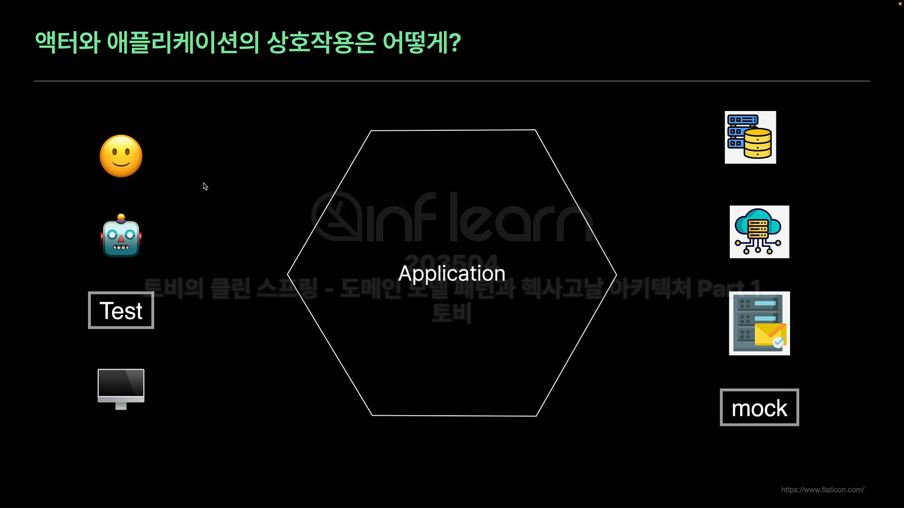
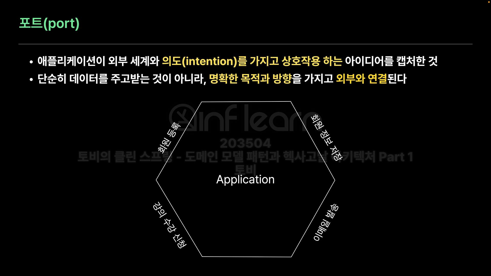
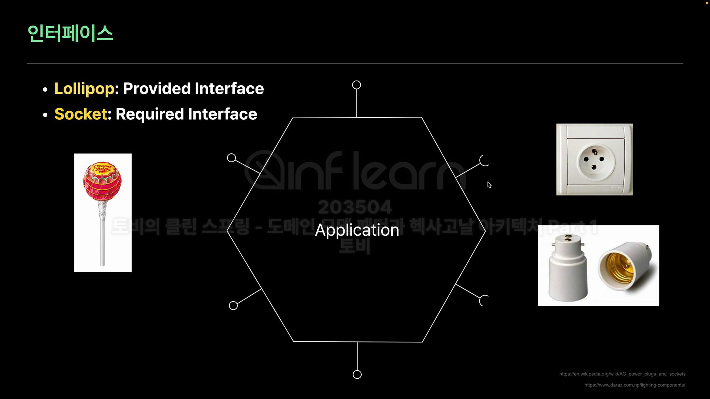
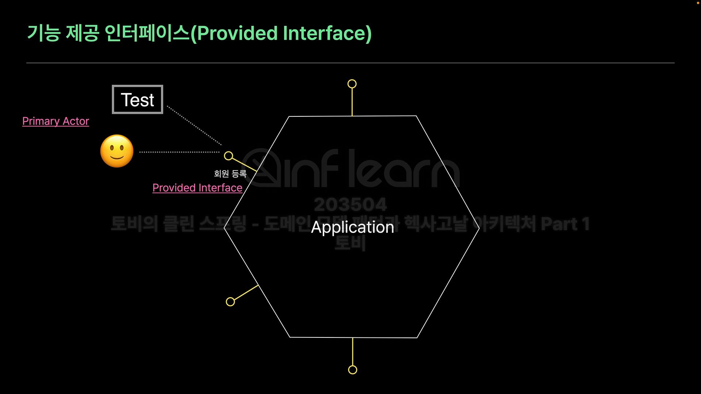
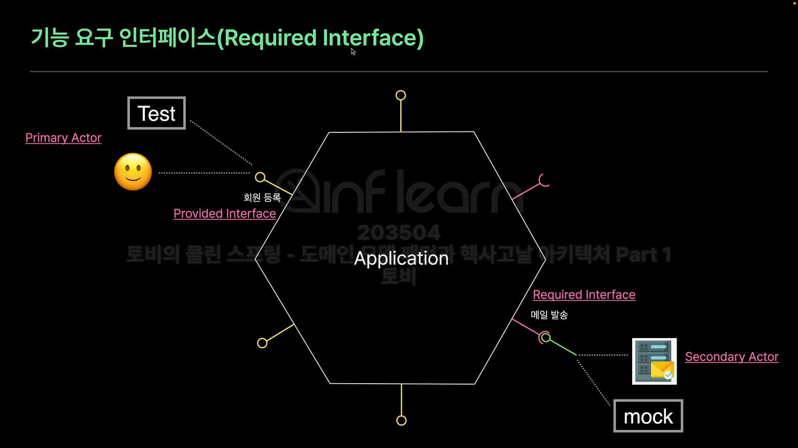
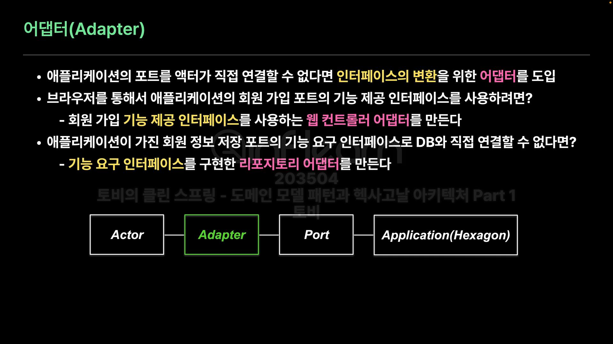
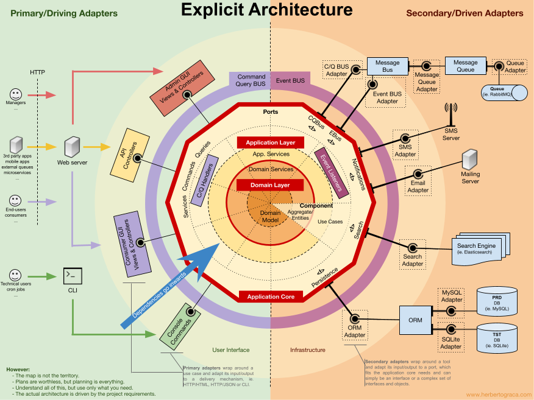
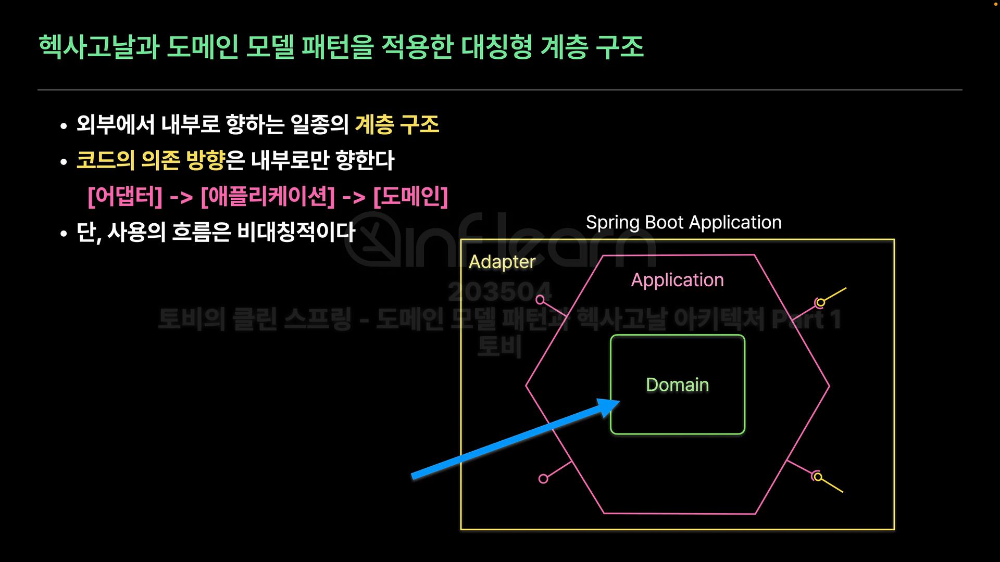

# 🔴 헥사고날 아키텍처의 사실과 오해

## 🟠 아키텍처 사실
- 시스템의 기본적인 구조를 정의한다
- 시스템의 중요한 품질 속성에 큰 영향을 미친다
- 설계 결정의 기반이 되는 핵심적인 개념이다
- 기본 구성 요소와 상호 관계, 제약 조건, 원칙 등을 포함한다

### 🟢 Layered Architecture
- 서브 시스템을 계층으로 구조화하는 아키텍처 스타일이다
- 계층은 사용 관계로 연결된다
- 사용 관계는 일반적으로 단방향이어야 한다는 핵심 제약이 있다
  - 상위 계층이 하위 계층의 서비스를 사용하는 하향식 흐름을 가진다
- 각 계층이 하위 계층의 내부 작동 방식을 알지 못하고 `제한된 인터페이스만 사용`하도록 한다
  - 어떤 레이어의 변경이 다른 레이어의 컴포넌트에게 가능한 영향을 주지 않도록 해야 한다

### 🟢 3계층 아키텍처
- 가장 오래 사용되고 있는 `전통적인 구조`
- 요청 -> Presentation(UI) -> Business Logic(Domain) -> Infra Structure(Data) 순으로 진행

### 🟢 Relaxed Layered Architecture (3 or 4계층 아키텍처)
- 요청 -> Presentation -> Application Service -> Domain -> Infra Structure
- Application Service 계층을 하나 더 두고 Domain을 호출하여 사용한다
- 경우에 따라서는 Application Service에서 Infra를 바로 호출하기도 한다.
- 완화된 계층형 아키텍처라 부르고 대부분 이 형식을 요즘 많이 사용한다.

## 🟠 헥사고날 아키텍처
- 2005년 앨리스터 코번이 제안한 아키텍처
- 계층형 아키텍처의 단방향 비대칭 구조가 아닌 대칭형(육각형) 아키텍처
- 위 아래, 좌 우가 아닌 애플리케이션의 내부와 외부 세계라는 대칭 구조를 가진다
- 육각형이 6면을 가진다고 해서 특별한 의미가 있는 것이 아닌 대칭을 쉽게 표현하기 위해 육각형으로 표현된것이다

### 🟢 헥사곤의 내부
- 쉽게 변하지 않는, 중요한 도메인 로직을 담은 코어 애플리케이션
  - 도메인의 핵심 로직(도메인 로직을 가진 트랜잭션 스크립트 or 도메인 로직 자체)이 헥사곤이 되는 것임

### 🟢 헥사곤 외부
- 헥사곤과 상호작용(interaction)하는 모든 것 - Actor
- 사용자, 브라우저, cli 명령, 기계, 다른 시스템
- 운영 환경, DB, MQ, 메일 시스템, 원격 서비스
- 테스트

### 🟢 헥사고날 아키텍처의 특징과 혜택
- 테스트를 쉽고 잘할 수 있게 만든 구조(가장 큰 목표)
- 애플리케이션과 상호작용하는 액터가 바뀌더라도 다시 빌드하지 않고 테스트
- UI 디테일이나 기술 정보가 도메인 로직 안으로 노출되지 않도록 보호한다
- 컴포넌트를 각각 개발하고 연결하는 방식으로 큰 시스템을 분리할 수 있다
- 시간이 지나면서 외부 연결을 다른 것으로 변경이 쉽다
- 기술 요소를 제거했기 때문에 도메인 설계에 집중할 수 있다(가장 큰 의미)

### 🟢 헥사곤을 부르는 여러 이름
- 애플리케이션, 앱, 코어 시스템, SuD(System Under Development), SuT(System under Test)

### 🟢 Port(포트)
- 애플리케이션이 외부 세계와 의도(intention)를 가지고 상호작용 하는 아이디어를 캡처한 것
- 단순히 데이터를 주고 받는 것이 아니라, 명확한 목적과 방향을 가지고 외부와 연결된다
- 애플리케이션의 정의한 인터페이스로 만들어진다

### 🟢 인터페이스 종류

- Lollipop
  - provided interface (기능 제공 인터페이스)
  
  
- Socket
  - required interface (기능 요구 인터페이스)
  

### 🟢 Adapter(어댑터)
- 애플리케이션의 포트를 액터가 직접 연결할 수 없다면 인터페이스의 변환을 위한 어댑터 도입
- 브라우저를 통해서 애플리케이션의 회원 가입 포트 기능 제공 인터페이스를 사용하려면?
  - 회원 가입 기능 제공 인터페이스를 사용하는 웹 컨트롤러 어댑터를 만든다
- 애플리케이션이 가진 회원 정보 저장 포트의 기능 요구 인터페이스로 DB와 직접 연결할 수 없다면?
  - 기능 요구 인터페이스를 구현한 리포지토리 어댑터를 만든다

### 🟢 포트와 어댑터 아키텍처
- 헥사고날 아키텍처의 특징을 담은 이름이 사실은 port & adapter architecture지만 모두 헥사고날 아키텍처라고 부름

### 🟢 헥사고날 아키텍처의 비대칭성
- 애플리케이션이 제공하는 기능을 사용하는 액터와 이를 위한 어댑터
  - primary actor, primary adapter
  - driving actor, driving adapter
  - 위 아래 둘다 동일한 의미임
- 애플리케이션이 동작하는데 필요한 기능을 제공하는 액터와 이를 위한 어댑터
  - secondary actor, secondary adapter
  - driven actor, driven adapter

## 🟠 헥사고날 아키텍처의 오해

### 🟢 헥사고날은 무조건 내부에 도메인을 만들어야 한다.
- 헥사고날 아키텍처는 내부 구현에 대한 원칙이 없다
  - 스파게티 코드로 만들어도 된다
  - 트랜잭션 스크립트로만 만들어도 된다
  - 도메인 계층을 포함하는 아키텍처는 클린 아키텍처다
- 헥사고날 아키텍처는 클린 아키텍처, 어니언 아키텍처가 아니다

### 🟢 헥사고날 아키텍처는 패키지 구조를 따라야 한다
- 헥사고날 아키텍처는 패키지 구조에 대한 제약이 없다
- 애플리케이션과 어댑터 패키지를 분리하는 것은 바람직하다
- 포트를 구분된 패키지에 두는 것을 권장한다
- 기존 시스템 구조를 사용해도 상관 없긴 하다

### 🟢 포트는 UseCase 접미사를 사용해야 한다
- 사실 포트 이름에 대해 제약이 없다
- 포트의 의도를 담은 이름을 사용하면 된다
- For + ing 스타일의 권장 네이밍이 있지만 굳이 따르지 않아도 된다

### 🟢 애플리케이션에는 도메인 모델만 넣고 JPA 등은 어댑터에 둬야 한다
- 애플리케이션 코드와 포트 인터페이스가 외부 기술에 의존하지 않으면 된다

### 🟢 헥사고날 아키텍처가 요구하는 것(사실)
- 애플리케이션은 모든 위부와의 상호작용을 위해 provided interface와 required interface를 정의한다
- 애플리케이션과 상호작용 하는 액터는 런타임에 구성되어야 한다
- 애플리케이션은 애겉에 대한 코드 의존성을 가지면 안된다
  - DB가 변경되거나 외부 시스템이 변경된다고 해도 내부 핵심 코드가 변경되지 않는다
- 액터는 정의된 포트를 통해서만 연결해야 한다
- 포트 인터페이서에는 기술 의존성을 가지지 않는다
  - 암호화 기술, 웹 기술, DB 기술 명칭을 따로 명명하지 않는다

### 🟢 헥사고날과 도메인 모델 패턴을 적용한 대칭형 계층 구조

- 외부에서 내부로 향하는 일종의 계층 구조
- 코드의 의존 방향은 내부로만 향한다
  - 어댑터 -> 애플리케이션 -> 도메인
- 단 사용의 흐름은 비대칭적이다

### 🟢 DDD 아키텍처는?
- 4개의 계층형 아키텍처
- 헥사고날의 아키텍처에서 도메인 로직을 담은 부분을 DDD 아키텍처로 봐도 된다